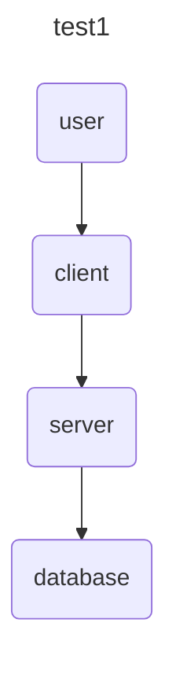
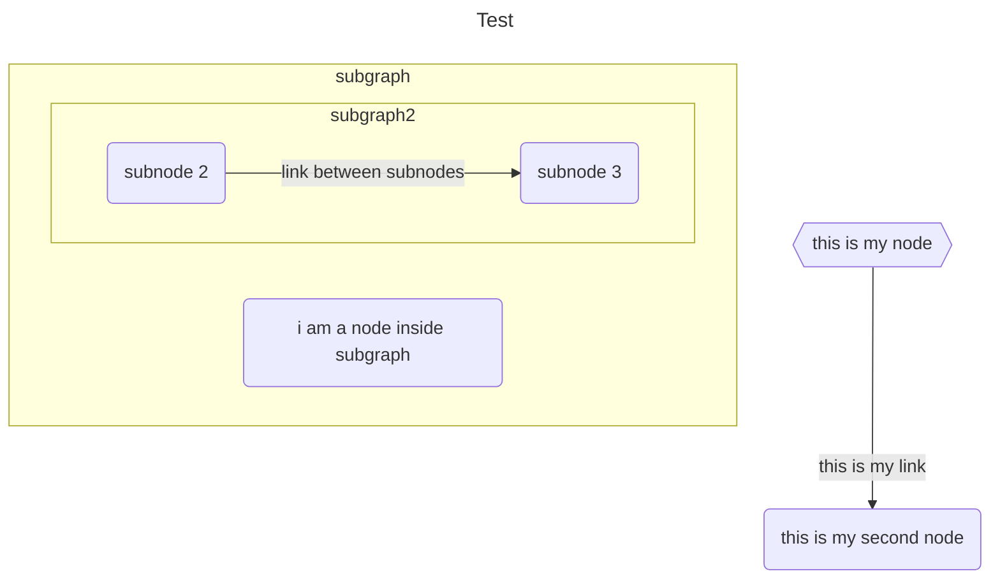
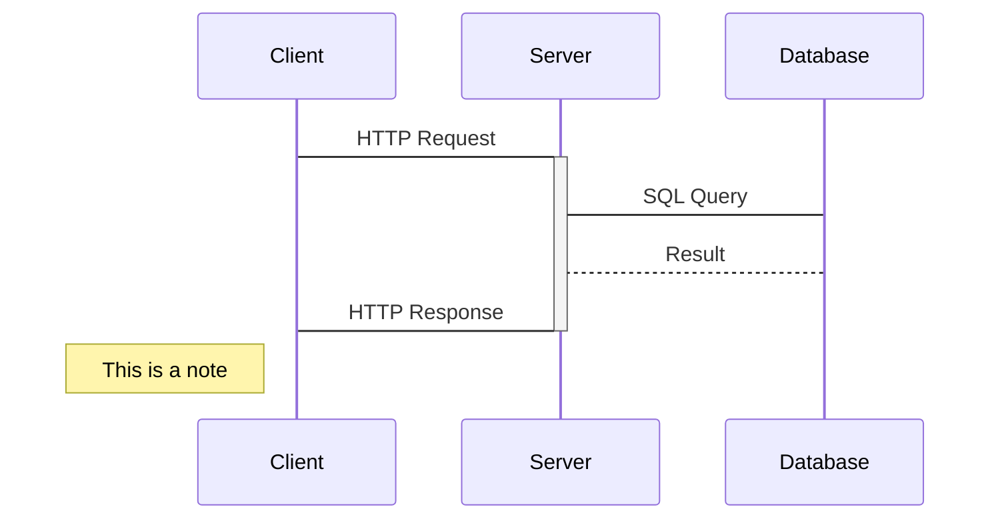

# Python MermaidJS Markup Builder

MermaidJS Markup builder helps to script MermaidJS markup creation.

MermaidJS is an amazing product, but the syntax is very human readable and writeable (comparing to graphviz for exmaple).

for example, node or arrow shape on a flowchart is something that is easy to see as ASCII, but not easy to adhoc script.

This library should help to write mermaidJS markup, which then can be rendered in Markdown/github or playground.

## NOTE: This is Work in progress

Next tasks on my list:
- [x] styling for flowchart (adding classes and styles)
- [ ] "clone with prefix" (creates a clone of a node or a subgraph but adds a prefix to ID, so the don't conflict)
- [ ] class diagrams
- [ ] groups for sequence diagrams
- [x] package for distribution


## Examples:

### Flow chart

#### untyped version
```python
from mermaid_builder.flowchart import Chart

chart = (Chart(title='test1')
    .add_node('user')
    .add_node('client')
    .add_node('server')
    .add_node('database')
    .add_link_between('user', 'client')
    .add_link_between('client', 'server')
    .add_link_between('server', 'database'))

print(chart)
```

result:



#### OOP (more complicated version)
```python
chart = Chart(title='Test', direction=ChartDir.TB)
node1 = Node(title="this is my node", id='my-node', shape=NodeShape.HEXAGON)
node2 = Node(title="this is my second node")
chart.add_node(node1).add_node(node2)
link = Link(src=node1.get_id(), dest=node2.get_id(), text='this is my link')
chart.add_link(link)
subgraph = Subgraph(title='subgraph', direction=ChartDir.LR)
subgraph.add_node(Node(title='i am a node inside subgraph'))

subgraph2 = Subgraph(title='subgraph2', direction=ChartDir.LR)
sn1 = Node(title='subnode 2')
sn2 = Node(title='subnode 3')
(subgraph2
    .add_node(sn1)
    .add_node(sn2)
    .add_link(Link(src=sn1, dest=sn2, text='link between subnodes')))
subgraph.add_subgraph(subgraph2)
chart.add_subgraph(subgraph)
```

result:




## Sequence diagram
```python
diagram = SequenceDiagram()
client = Participant(id='C', label='Client')
server = Participant(id='S', label='Server')
database = Participant(id='D', label='Database')
(diagram
    .add_participant(client)
    .add_participant(server)
    .add_participant(database)
    .add_message(Message(src=client, dest=server, text='HTTP Request', activation_mode=ActivationMode.ACTIVATE))
    .add_message(Message(src=server, dest=database, text='SQL Query'))
    .add_message(Message(src=database, dest=server, text='Result', arrow=ArrowType.DOTTED_LINE_NO_ARROW))        
    .add_message(Message(src=server, dest=client, text='HTTP Response', activation_mode=ActivationMode.DEACTIVATE))
    .add_note(Note(participants=[client], text='This is a note', position=NotePosition.LEFT_OF)))
```




see `flowchart_test.py` and `sequence_diagram_test.py ` for more examples.


## Development

This library doesn't have any dependencies.
```bash
python3 -m venv venv
source venv/bin/activate
pip3 install -e .
```
Just use python3.5+ , as it's using `types` and `Union`


### Run tests
```bash
pytest
```

to preview - paste results to 
https://www.devtoolsdaily.com/diagrams/mermaidjs/playground/

for example:
[Example Playground Link](https://www.devtoolsdaily.com/diagrams/mermaidjs/playground/#v2=N4IgtghgTg1grgBxALhAWgwHQHYBcCWuANgKbIAEAKiQM644Zo4BmRA9gO4DGAFtLlQBCOcuTABPNNjYATEsGC4e+GuRVjx5aXIC+OkeSUqVEmiS5tsM7SQAUR1eonkzFq1tkkAlAYlTP5BgAfOQAPg5qqs5E+Ngw4co0JuKultaeBjFxAMq44qTkAAwuuFBsMCRoHPgySsgATAgAHgA0FuxQyFAkMgDcvpI2gWghNHAARgDmUBAIPPUGY1Mzc+QAsuLZE9OzPOQA2hvkW8u7ALoGojL43VwEluQAMgBKl2oQkDaxSXJLO3O2fDkD7AjxyNTYH4kFzbFY8HzYUSiP5wmGnOb1A4o3b1C6IpFXG7me6Il5vZETGz1WxLIb1LzIRlcIgQGg0ACM5LRNgAzDTKQEeQiCRTxlThiFQlkYORxiRcBwSCREbTPDRQqq5Dy3sqZAZdQZmayaAAREjMchGtns8jMfBEIjIADEzAAnMwWnQyhVnTy-Z7SuVKtVajwGs1+virabzZaWWzMXaHb7CoUA96yE6AGw59NBqo1OoAVmabTYHS6PTzFTQMlZfCgM3EyCL5CLhvjqk1JB5ceN7MjomjGn84OjA47xsMiWSqSsQ2j9UH5GluXy0MxXvzIbqjVa7TYnWmSuwvRAOiAA)
